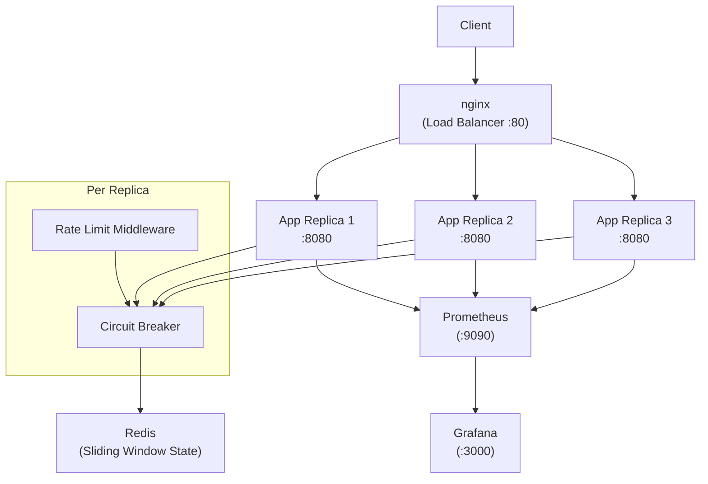
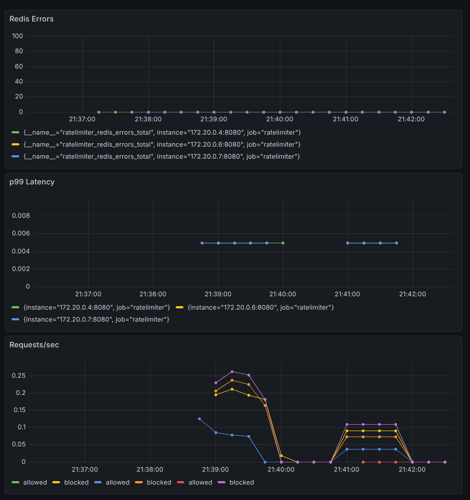

# Distributed Rate Limiter

A production-grade distributed rate limiter written in Go — a core security primitive for DDoS mitigation, API abuse prevention, and infrastructure protection. Enforces per-IP request limits across horizontally scaled services via shared Redis state, with full observability and fault tolerance.

## System Architecture



**Key property:** all 3 replicas share a single Redis instance. A client exhausting their limit on replica 1 is blocked on replica 2 — the rate limit is enforced globally, not per-process.

## Code Structure

```
cmd/server/           Entry point, config, signal handling, HTTP routing
internal/
├── config/           Environment-based config with .env support
├── limiter/
│   ├── limiter.go        Limiter interface + Result struct
│   ├── bucket.go         Token bucket + Manager (double-checked locking, cleanup goroutine)
│   ├── redis_manager.go  Redis sliding window via atomic Lua script
│   └── circuit_breaker.go  Three-state fault tolerance (closed/open/half-open)
├── middleware/       HTTP middleware — IP extraction, enforcement, response headers
└── metrics/          Prometheus instrumentation
```

Algorithm (`limiter/`) is fully decoupled from transport (`middleware/`) via the `Limiter` interface. Backends are swappable at runtime via env var.

## Features

**Rate Limiting**
- **Sliding window** (Redis) — atomic Lua script on sorted sets, eliminates the boundary-burst problem of fixed-window counters
- **Token bucket** (in-memory) — burst-tolerant with configurable capacity and refill rate; background goroutine evicts idle buckets
- Standard response headers: `X-RateLimit-Limit`, `X-RateLimit-Remaining`, `X-RateLimit-Reset`

**Fault Tolerance**
- **Circuit breaker** — detects Redis failures, opens after N consecutive errors, tests recovery via half-open state, configurable fail-open/fail-closed policy
- **Graceful shutdown** — drains in-flight requests, closes Redis connections cleanly on SIGINT/SIGTERM

**Observability**
- **Prometheus metrics** — `ratelimiter_requests_total` (by status), `ratelimiter_request_duration_seconds` (histogram), `ratelimiter_redis_errors_total`
- **Grafana dashboard** — requests/sec by allow/block status, p99 latency, Redis error rate


- **Health endpoints** — `/healthz` (liveness), `/readyz` (readiness with Redis ping)

**Infrastructure**
- Multi-stage Docker build (~15MB final image)
- Docker Compose: 3 app replicas + Redis + nginx + Prometheus + Grafana

## Quick Start

```bash
docker compose up --build
```

Hit `http://localhost` — after 5 requests the limiter engages. Metrics at `http://localhost:9090`, dashboard at `http://localhost:3000`.

Run locally:
```bash
cp .env.example .env  # configure env vars
go run ./cmd/server
```

## Configuration

| Variable | Default | Description |
|---|---|---|
| `MODE` | `redis` | `redis` (distributed) or `local` (in-memory) |
| `REDIS_ADDR` | `localhost:6379` | Redis address |
| `RATELIMIT` | `5` | Max requests per 60s window |
| `PORT` | `:8080` | Listen port |
| `FAIL_OPEN` | `false` | Allow traffic when Redis is unreachable |

## Tests

```bash
go test ./...
```

- **Token bucket** — capacity enforcement, refill over time, ceiling cap
- **Manager** — per-key isolation, pointer identity, concurrent access
- **Circuit breaker** — all state transitions (closed → open → half-open → closed/open)
- **Middleware** — status codes (200/429), IP extraction, interface mocking

## Concurrency & Distributed Systems Patterns

- `sync.RWMutex` with double-checked locking for concurrent bucket map access
- `sync.Mutex` for token bucket and circuit breaker state
- Goroutine + `time.Ticker` + `select` for background cleanup with context-aware shutdown
- `signal.NotifyContext` for coordinated graceful shutdown across goroutines
- Atomic Redis operations via Lua scripting (INCR + EXPIRE race condition eliminated)
- DNS-based service discovery for Prometheus scraping across replicas
